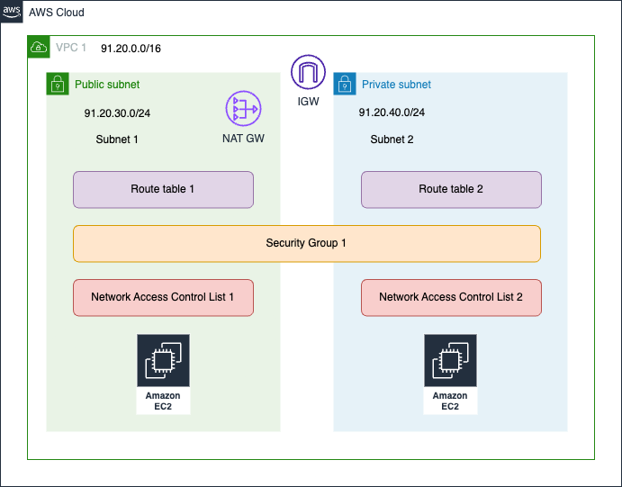
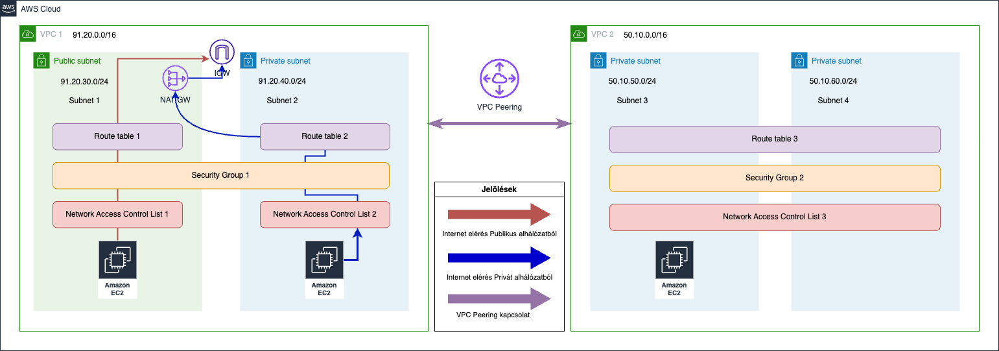
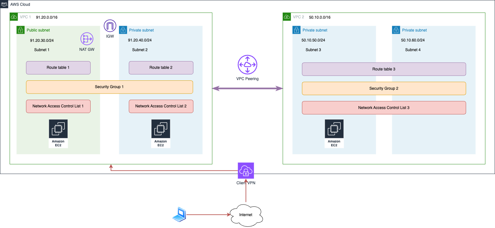

# Mentor Klub - AWS haladó videós képzés segédanyagai

## Tartalomjegyzék

1. [Képzés információ](#képzés-információ)
2. [Tematika és segédanyagok](#tematika-és-segédanyagok)
3. [Arhitektúra ábrák](#arhitektúra-ábrák)
   1. [VPC 1](#vpc-1)
   2. [VPC 1 és VPC 2 + Peering](#vpc-1-és-vpc-2--peering)
   3. [VPN (Point to site)](#vpn-point-to-site)
4. [Hasznos linkek](#hasznos-linkek)
5. [Kérdés vagy észrevétel](#kérdés-vagy-észrevétel)
6. [Jogok és felelősség](#jogok-és-felelősség)

## Képzés információ

Fedezd fel az AWS cloud világának mélységeit a mi haladó szintű videós képzésünkkel! Ha már ismered az AWS alapjait és szeretnél mélyebben elmerülni az előfizetés létrehozásának és beállításának, a hálózati architektúrák (VPC, Peering, VPN, DNS) finomságaiba, a virtuális gépek (méretezés, skálázás, terheléselosztás) művészetébe, akkor ez a képzés neked szól.

Jelentkezni: https://mentorklub.gerillaoneletrajz.hu/tartalomjegyzek

## Tematika és segédanyagok

Itt találod a képzéshez használt kódokat és segédanyagokat.

2. Előfizetés alapjai
   1. 02 - Előfizetés alapjai
   2. 03 - Előfizetés létrehozása (bemutató)
   3. 04 - Előfizetés beállítása (bemutató)
3. Hálózat
   1. 05 - Virtuális Hálózat és Alhálózat
   2. 06 - Hálózati eszközök és megoldások
   3. [07 - Virtuális hálózat (bemutató)](https://github.com/cloudsteak/trn-aws-common/blob/main/network.md#vpc-létrehozása)
   4. [08 - VPC Peering](https://github.com/cloudsteak/trn-aws-common/blob/main/network.md#vpc-peering)
   5. 09 - VPN
   6. [10 - VPN (bemutató)](https://github.com/cloudsteak/trn-aws-common/blob/main/network.md#vpn-virtual-private-network)
   7. 11 - DNS
4. Virtuálisgépek
   1. 12 - Virtuálisgépek
   2. 13 - Virtuálisgép méretezése (bemutató)
   3. 14 - Skálázás
   4. 15 - Skálázás (bemutató)
   5. 16 - Terhelés elosztás
   6. 17 - Terhelés elosztás (bemutató)
5. Tárhely kezelése (S3)
   1. 18 - S3 tulajdonságai
   2. [19 - S3 (bemutató - fájlmegosztás, verziózás, weboldal, adatkezelés)](https://github.com/cloudsteak/trn-aws-common/blob/main/storage.md#s3)
6. Adatbázisok
   1. 20 - Adatbázisok a felhőben
   2. [21 - Webalkalmazás és SQL (bemutató)](https://github.com/cloudsteak/trn-aws-webapp-sql)
   3. [22 - Webalkalmazás és NoSQL (bemutató)](https://github.com/cloudsteak/trn-aws-webapp-nosql)
7. Kiszolgálómentesen
   1. 23 - Kiszolgáló nélküli megoldások és AWS Lambda
   2. [24 - Lambda, S3 és SNS integráció (bemutató)](https://github.com/cloudsteak/trn-aws-common/blob/main/serverless.md#eseményvezérelt-alkalmazás-s3---lambda---sns)
8. Monitoring
   1. 25 - CloudWatch és Amazon SNS
   2. [26 - EC2 monitorozás és riasztás (bemutató)](https://learn.microsoft.com/en-us/sysinternals/downloads/cpustres)
9. Mentési megoldások
   1. 27 - Mentési megoldások
   2. 28 - EC2 mentése (bemutató)

## Arhitektúra ábrák

### VPC 1

### VPC 1 és VPC 2 + Peering

### VPN (Point to site)

## Hasznos linkek

- AWS-hez kpcsolódó példák és leírások: https://github.com/cloudsteak/trn-aws-common
- Szótár: https://link.cloudmentor.hu/cloudszotar
- AWS szójegyzék: https://docs.aws.amazon.com/general/latest/gr/glos-chap.html
- Felhők összehasonlítása: https://lucid.app/lucidchart/13fde51a-271f-456a-b2b3-ef6869f9ee6a/view?page=GiFLkXTb1E1J
- Ár kalkulátor: https://calculator.aws
- Reserved instances árak összehasonlítása: https://instances.vantage.sh
- Szolgáltatás korlátok: https://docs.aws.amazon.com/general/latest/gr/aws_service_limits.html
- AWS dokumentáció: https://aws.amazon.com
- AWS CLI: https://aws.amazon.com/cli/
- Elastic Beanstalk CLI: https://docs.aws.amazon.com/elasticbeanstalk/latest/dg/eb-cli3-install.html
- EKS CTL: https://eksctl.io
- CPU Stress: https://learn.microsoft.com/en-us/sysinternals/downloads/cpustres

## Kérdés vagy észrevétel

Az alábbi linken tudsz kérdezni vagy hibát jelezni: https://github.com/cloudsteak/mentor-klub-cloud/issues/new/choose

## Jogok és felelősség

Minden a kódokkal, oktató anyagokkal kapcsolatos jogot a Mentor Klub és CloudSteak fenntart. Az anyagokat csak saját felhasználásra használhatod fel, azokat másolni, terjeszteni, publikálni csak a szerzők írásos engedélyével lehetséges. Az anyagok használatából eredő károkért a szerzők felelősséget nem vállalnak.

Licensz: [Creative Commons (CC0 1.0 Universal)](./LICENSE)
